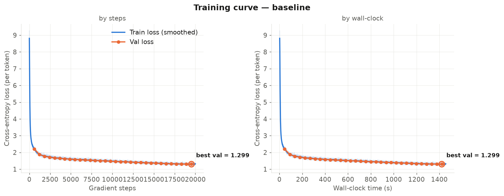
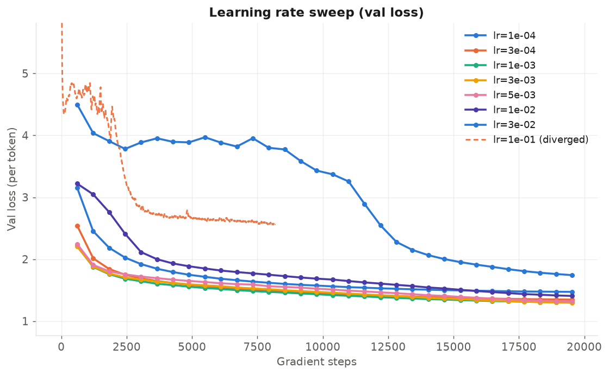
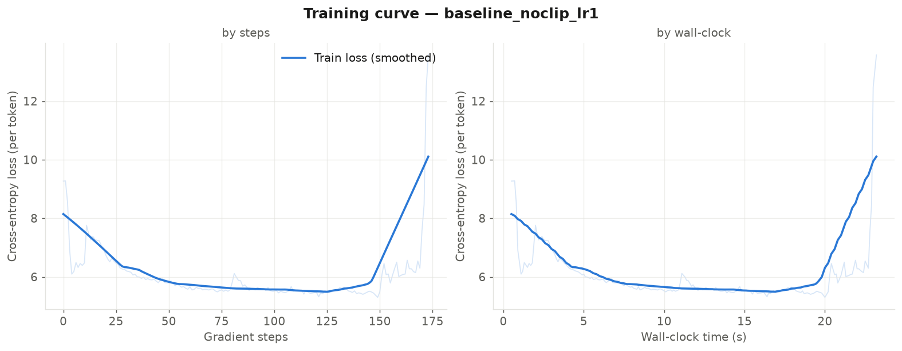
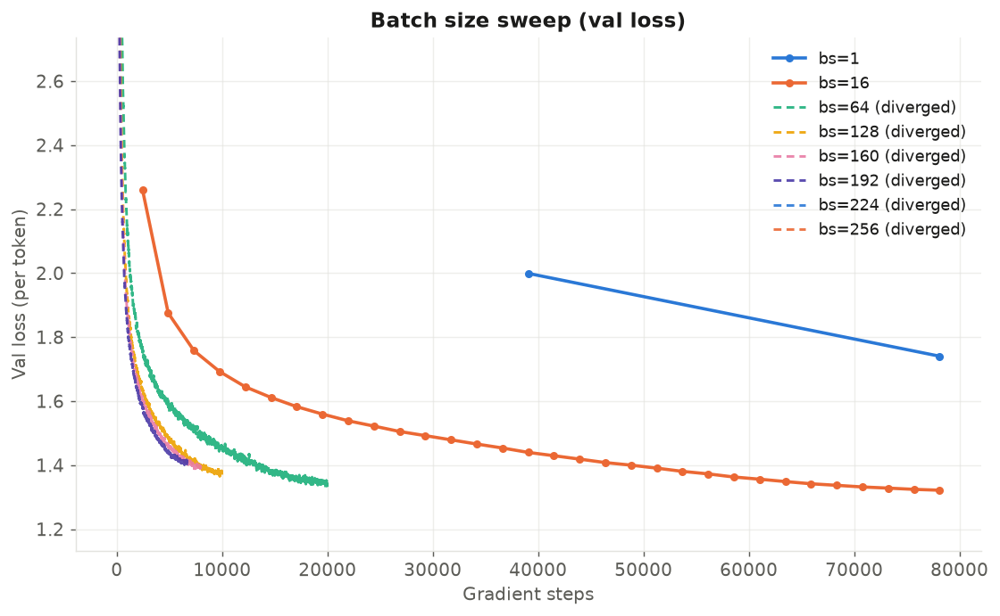
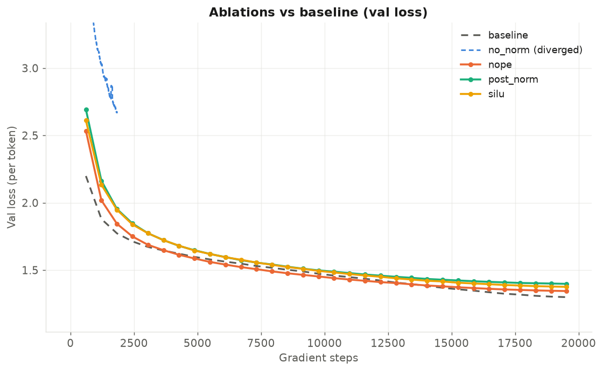

# StoryLM

> **从零实现并训练一个 GPT 风格的小语言模型** —— 不依赖任何高层网络模块,手写 BPE 分词器、Transformer、优化器与训练框架,并在 TinyStories 上完成系统的超参调优、发散边界分析与架构消融。

<p>


</p>

一个约 **22.7M 参数**的 decoder-only Transformer(RoPE · RMSNorm · SwiGLU),完全从零实现——**不使用 `nn.Linear` / `nn.MultiheadAttention` / `nn.LayerNorm` 等高层模块**,所有权重都是 `nn.Parameter` + 手写前向。在单张 RTX 4090 上约 24 分钟即可训练到验证损失 **1.30**,能生成通顺连贯的短故事。

---

## 特性

- **完全从零实现**:BPE 分词器、RoPE 旋转位置编码、RMSNorm、SwiGLU、多头因果自注意力、AdamW、cosine 学习率调度、梯度裁剪、checkpoint —— 全部手写,不调高层 API。
- **一条命令跑实验**:baseline、学习率扫描、batch size 扫描、四类架构消融、文本生成,统一子命令入口。
- **系统的实验分析**:不止"跑通",还包含学习率的 U 型曲线与发散边界探索、batch size 的甜点区与显存上限、四组架构消融对照。
- **开箱即用的可视化**:一个脚本把训练日志自动画成学习曲线(支持按步数 / 按墙钟时间、深浅双色、发散标注)。
- **工程细节**:`torch.compile` 加速、mmap 按需读数据(避免 1GB 数据集塞满内存)、发散保护、确定性验证评估。

---

## 生成示例

模型(验证损失 1.30)在 prompt `"Once upon a time"` 下的生成(temperature=0.8, top-p=0.9):

```text
Once upon a time, there was a big bear. The bear was very independent. He liked to do
things by himself. One day, the bear was walking in the woods. He saw a big tree and
wanted to climb it. The bear climbed the tree. He saw a bird and said, "Hi, bird!" ...
The big bear and the little bear became friends. They played together in the woods.
The big bear was not so independent anymore. He was happy to have a new friend.
And they both lived happily ever after.
```

语法正确、有完整的"起因—经过—结尾"结构;局限是偶有重复与角色指代不一致——这是 22.7M 小模型的典型边界。

---

##  实验结果

> 完整实验记录见 [`exp/experiment_log.md`](exp/experiment_log.md)。

### Baseline

| 指标 | 数值 |
| ---- | ---- |
| 最佳验证损失 | **1.2994**(per-token 交叉熵) |
| 学习率 | 3e-3(经扫描得出的最优) |
| 训练时间 | ~24 min @ RTX 4090(≈23 万 tokens/s) |



### 学习率:U 型曲线与稳定性边界

学习率扫描呈现典型的 U 型:谷底在 **3e-3**(1.296),两侧对称升高。

| lr | 1e-4 | 3e-4 | 1e-3 | **3e-3** | 5e-3 | 1e-2 | 3e-2 |
| -- | ---- | ---- | ---- | -------- | ---- | ---- | ---- |
| val | 1.472 | 1.347 | 1.301 | **1.296** | 1.318 | 1.407 | 1.743 |



**一个更深的发现**:单纯加大学习率**很难让模型发散**——lr 加到 1e-1 都稳如泰山。追查后确认:稳定性由**梯度裁剪 + AdamW 自适应更新**两道防线共同维持,必须**同时**关闭梯度裁剪且把 lr 拉到 1.0,才在 step 174 触发发散(loss 爆炸)。这比"调大 lr 就发散"的朴素预期深刻得多。



### Batch Size:甜点区与显存上限

固定总 token 预算下,batch size 与最终性能**非单调**——存在甜点区(16),且并非越大越好;192 是 RTX 4090 (24GB) 能稳定训练的最大 batch,224 直接 OOM。

| batch | 1 | **16** | 64 | 128 | 192 | 224 |
| ----- | -- | ----- | -- | --- | --- | --- |
| val | 1.741 | **1.322** | 1.342 | 1.374 | 1.404 | OOM |



### 架构消融(对照:标准模型 lr=3e-4,val=1.347)

| 消融 | 结果 | 结论 |
| ---- | ---- | ---- |
| 去掉 RMSNorm | **step 1842 发散** | 归一化对训练稳定性是决定性的 |
| Post-Norm(替代 Pre-Norm) | 1.398 | Pre-Norm 更优 |
| 去掉位置编码(NoPE) | 1.345 | ≈ RoPE:短序列 + 因果掩码下位置编码增益有限 |
| SiLU FFN(替代 SwiGLU) | 1.376 | SwiGLU 的门控机制有效 |



**组件重要性排序**:RMSNorm(稳定性) > SwiGLU 门控 ≈ Pre-Norm(性能) > 位置编码(此任务下影响最小)。

---

##  模型架构

| 组件 | 设置 |
| ---- | ---- |
| 类型 | Decoder-only Transformer(GPT 风格) |
| 参数量 | 22.7M(非嵌入 12.5M) |
| 层数 / d_model / heads | 4 / 512 / 16 |
| FFN | SwiGLU,d_ff=1344(≈ 8/3·d_model) |
| 位置编码 | RoPE(θ=10000) |
| 归一化 | RMSNorm,Pre-Norm 结构 |
| 词表 / 上下文长度 | 10000(BPE)/ 256 |
| 优化器 | AdamW(β=0.9/0.999)+ cosine 调度 + warmup + 梯度裁剪 |
| 初始化 | 截断正态(std=0.02) |

---

## 快速开始

```bash
# 1. 安装依赖（使用 uv）
uv sync

# 2. 准备数据（下载 TinyStories，训练 BPE 分词器并编码为 .npy）
#    需在 data/ 下得到 tinystories_train.npy / tinystories_valid.npy / vocab.json / merges.txt
#    数据处理脚本见 storylm/prepare_data.py

# 3. 训练 baseline（约 24 分钟 @ RTX 4090）
uv run train_experiment.py baseline --lr 3e-3 --compile

# 4. 生成文本
uv run train_experiment.py generate --checkpoint checkpoints/baseline_best.pt \
    --prompt "Once upon a time"

# 5. 复现实验
uv run train_experiment.py lr_sweep    --lr 1e-4 3e-4 1e-3 3e-3 --compile
uv run train_experiment.py batch_sweep --batch_sizes 1 16 64 128 192 --compile
uv run train_experiment.py ablate_no_norm   --lr 3e-4 --compile   # 及 post_norm / nope / silu

# 6. 一键出图（深浅两版 → figures/）
uv run plot_experiments.py

# 复现发散实验（关闭梯度裁剪 + 大学习率）
uv run train_experiment.py baseline --lr 1.0 --max_grad_norm 1e9 --tag noclip_lr1
```

自检(验证实现正确性,单 batch 应快速过拟合到 ~0):

```bash
uv run train_experiment.py overfit_test
```

---

##  项目结构

```
StoryLM/
├── storylm/
│   ├── my_transformer.py   # 从零实现：BPE 分词器 + Transformer 全部组件
│   ├── model.py            # 张量算子（linear/embedding/attention/rope/...）
│   ├── train.py            # 交叉熵、梯度裁剪、cosine 调度、AdamW、checkpoint
│   └── tokenizer.py        # BPE 训练与编解码
├── train_experiment.py     # 训练 / 实验 / 生成 统一入口
├── plot_experiments.py     # 学习曲线可视化
├── exp/experiment_log.md   # 详细实验记录（含全部结果与分析）
├── figures/                # 生成的学习曲线图（light/ 与 dark/）
├── logs/                   # 训练日志（CSV）
└── data/                   # 数据集（需自行准备）
```

---

##  关键结论

1. **超参**:最佳学习率 3e-3,baseline 验证损失 1.30;batch size 存在甜点区(16),并非越大越好。
2. **稳定性**:训练稳定性来自梯度裁剪与 AdamW 自适应的叠加,单调加大 lr 不足以发散——这是一个反直觉但可复现的工程发现。
3. **架构**:RMSNorm 去掉即发散(稳定性关键);Pre-Norm > Post-Norm;SwiGLU 门控优于纯 SiLU;短序列任务下 NoPE ≈ RoPE(有意思的负结果)。

---

## 🛠 技术栈

Python · PyTorch(仅用张量与 autograd,不用高层 nn 层)· NumPy · matplotlib · uv

---

##  参考

- Eldan & Li, *TinyStories: How Small Can Language Models Be and Still Speak Coherent English?* (2023) —— 训练数据集
- Su et al., *RoFormer: Rotary Position Embedding* (2021) —— RoPE
- Shazeer, *GLU Variants Improve Transformer* (2020) —— SwiGLU
- Zhang & Sennrich, *Root Mean Square Layer Normalization* (2019) —— RMSNorm
- Touvron et al., *LLaMA* (2023) —— 整体架构参考

---

## 📄 License

MIT
